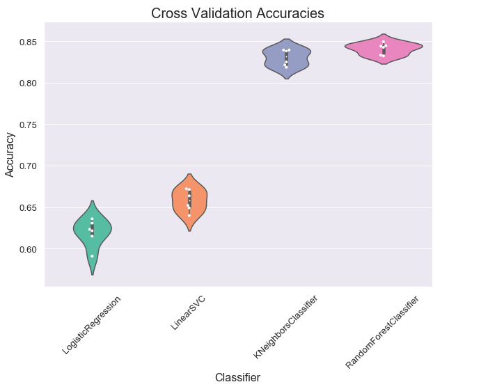
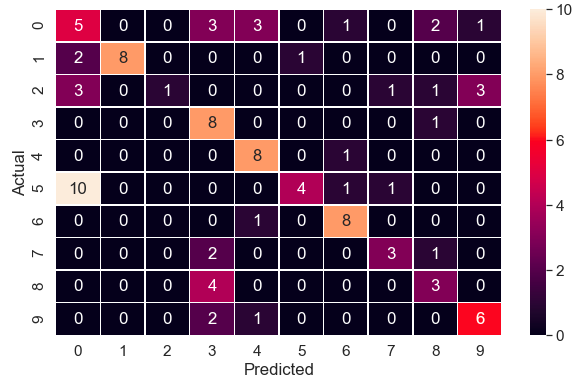

# Music Genre Classification

## Overview

This project classifies the audio clips into 10 different genres namely Blues, Classical, Country, Disco, Hiphop, Jazz, Metal, Pop, Reggae and Rock.
The audio clips are transformed into Mel-Spectrograms. These spectrograms are then feed into fine tuned VGG16 model. On the other hand,
various features are extracted from the clips which are utilized to train machine learning algorithms. These features include zero crossing rate, root mean square energy, tempo(beats per minute), mel frequency cepstral coefficients(mfcc), chroma feature, spectral centroid, pth order moment about spectral centroid, spectral contrast(min. & max. differnce between frequency bands) and roll-off frequency                                                                                                                                                       

To transform audio clips into Mel-Spectrograms , a python package called __Librosa__ is used

The package performs the following implementation steps to convert the clip to Melspectorgam :

* Define the window function and overlap amount
* Generate window segments(Multiply signal by window function)
* Apply Fast Fourier Transform(FFT) to each window segment
* Map the powers of the spectrum obtained above onto the mel scale, using triangular overlapping windows.

To extract Mel-frequency cepstral coefficients (MFCCs)
 *Take the logs of the powers at each of the mel frequencies.
 *Take the discrete cosine transform of the list of mel log powers, as if it were a signal.
 *The MFCCs are the amplitudes of the resulting spectrum.

<p align="center">
  
</p>

(*Source: MathWorks*)


## Result

<p align="center">
   
<p align="center">
    <b>Cross-Validation Accuracies on Machine Learning Algorithms</b>
</p>
&nbsp;&nbsp;&nbsp;&nbsp;&nbsp;

<p align="center">
  
  
</p>  
<p align="center">
    <b>VGG-16 Model Confusion Matrix</b>
</p>


The Fine tuned VGG16 model achieved 55% accuracy on test set and ```60%``` on validation set. On the other hand, K-Nearest Neighbor(k-NN) Algorithm
achieved ```85%``` accuracy on test set.

## Referenes
https://arxiv.org/pdf/1804.01149

Dataset can be downloaded from [here](http://opihi.cs.uvic.ca/sound/genres.tar.gz)

http://www.speech.cs.cmu.edu/15-492/slides/03_mfcc.pdf
